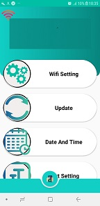

this app is used for controling lightning devices suchas 32branch,Luminous Orb and Screen.
these devices are made from a lot of leds or led pixels that their colors change and can display animation or text.Moreover,it can display an animations on a sepecified date and time 
this android app can change current animation,send text,set and get date and time for them,coordinate a set of lightning devices by setting a radio code(NRF technology)
furthermore viewing and changing all files on sd card attached to central controller is possible
this android application can update wifi module code to which is connected.

